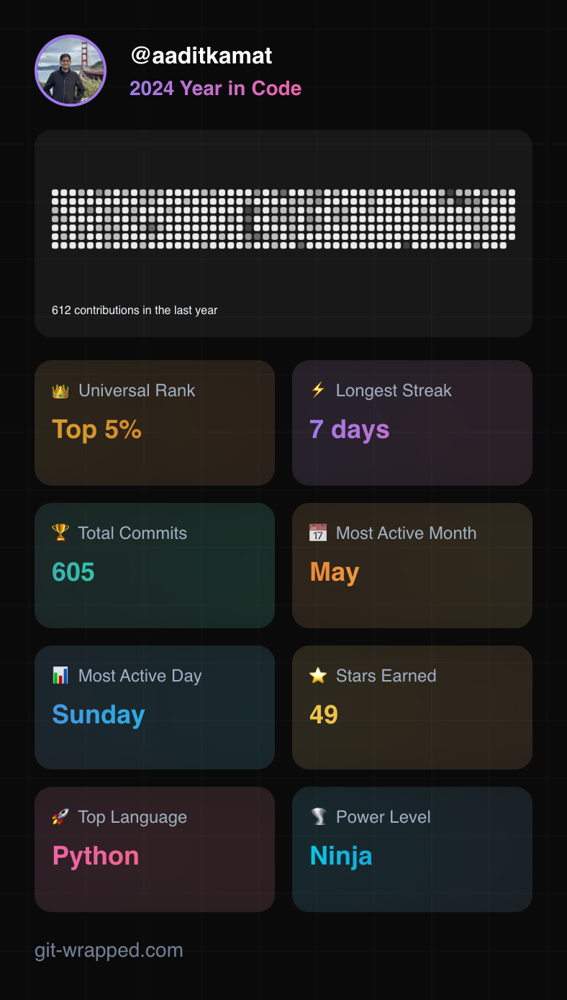

# Aadit Kamat (he/him/his)

## Brief Intro
I am a graduate student majoring in Information Systems at the University of Florida. I am currently interning as a Data Analyst at Getzler Henrich & Associates LLC. At Getzler Henrich, our main focus is on creating customized 13-week cash flow models for **middle-market firms (firms that generate revenue between $10 million to $100 million)** under financial distress, assisting them in **improving their economic outcomes**. Before joining this Master's program, I worked as a **Quality Assurance Engineer at Shopee** and a **junior Software Engineer at Visa**. 

As a QA Engineer at Shopee, I was responsible for designing and **executing automated test cases for the Android app**, utilizing our in-house testing framework to enhance the user experience. At Visa, I **developed APIs and designed the front end** for an Admin portal used by Innovation Centre teams in APAC and EMEA.

My academic journey has been an exciting pivot from my previous engineering roles. Throughout this program, I have acquired skills in **statistical analysis**, advanced Excel for **quantitative analysis**, **modeling business requirements** using tools such as ER diagrams, and **implementing them using databases**.

Last summer, I completed a project for RMS focusing on **gleaning insights from the financial data of restaurants** using Metiri and **comparing methods for benchmarking financial performance across decision-making units**. 

I enjoy learning new things, collaborating with others, and growing together.

Hit me up if you want to:
💬 chat about topics such as college life, software development, Effective Altruism, and spirituality OR collaborate on a real-world Data Analytics project

## Fun fact
My first name means **Peak** or **Sun God**

## GitHub stats

   

<!--END_SECTION:waka-->
## Contact

