# Aadit Kamat (he/him/his)

--- 

- 🧠 **What I build:** Full stack web and mobile applications

- 🎨 **What I care about:** Building accessible applications and scalable/efficient systems

- 🧩 **Tech I'm using:** React & Angular (JavaScript/TypeScript), Python, Spring Boot (Java), SQL (PostgreSQL/MySQL/Oracle) 

- 🚀 **Fun fact:** I've also dabbled with Test Automation as a Quality Assurance Engineer along with some Data Science

--- 
📷 Photo Time 

Here's a photo I took after my [consulting presentation with UF AIS](https://www.ufais.org/consulting-application)

### 🛠️ My Toolkit

---

### 📊 GitHub Stats

---

### 💻 Recently working on
<!--START_SECTION:activity-->
1. 💪 Opened PR [#366](https://github.com/aaditkamat/personal-website/pull/366) in [aaditkamat/personal-website](https://github.com/aaditkamat/personal-website)
2. ℹ️ Assigned PR [#223](https://github.com/aaditkamat/QMB6945-RMS-Project/pull/223) in [aaditkamat/QMB6945-RMS-Project](https://github.com/aaditkamat/QMB6945-RMS-Project)
3. 💪 Opened PR [#223](https://github.com/aaditkamat/QMB6945-RMS-Project/pull/223) in [aaditkamat/QMB6945-RMS-Project](https://github.com/aaditkamat/QMB6945-RMS-Project)
4. 💪 Opened PR [#361](undefined) in [aaditkamat/personal-website](https://github.com/aaditkamat/personal-website)
5. 💪 Opened PR [#360](undefined) in [aaditkamat/personal-website](https://github.com/aaditkamat/personal-website)
<!--END_SECTION:activity-->

--- 

### 💬 Let's Connect!

Feel free to reach out if you want to collaborate on a project, talk about web development, open source and a career in tech!

[LinkedIn](https://linkedin.com/in/aaditkamat) • [My Scrimba Profile](https://scrimba.com/@aaditkamat?via=u098vb) • [My Favorite Scrimba Course](https://scrimba.com/learn-cybersecurity-c0ggmpl7f9?via=u098vb) • [Portfolio](https://aaditkamat.dev)
